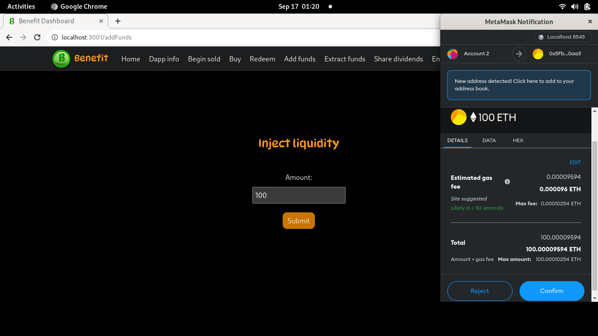
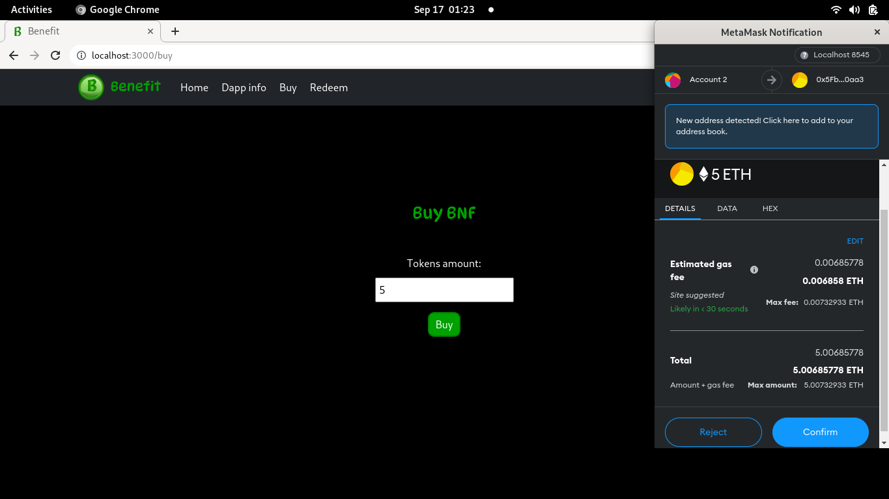

# Benefit 2

## Descripción:

Benefit es un broker descentralizado que consiste en un contrato inteligente elaborado con Solidity y dos aplicaciones de frontend (una para el usuario y otra para el administrador) realizadas con ReactJS.

La idea es que el administrador pondrá a la venta una serie de tokens. Los usuarios los comprarán y cuando lo hagan aportarán liquidez al contrato. Con esta liquidez, el administrador puede hacer retiros para realizar operaciones y obtener beneficios que se agregarán al contrato. En el momento en que se porduzca un reparto de beneficios los usuarios recibiran una cantidad del total a reparir proporcional a la cantidad de tokens que tengan.

## Tecnologías empleadas:

### Hardhat:

Hardhat es un entorno de desarrollo que nos permite compilar, desplegar y muchas otras funcionalidades que nos facilitan la labor a la hora de trabajar con nuestros contratos inteligentes.

### Open Zeppelin:

Es una librería de contratos inteligentes que nos permite reutilizar contratos lo que hace que ahorremos tiempo a la vez que implementamos un código mucho más robusto.

### ReactJS:

Es la librería que empleamos para desarrollar aplicaciones en la parte del cliente. En ese caso, hemos utilizado la estructura que nos proporciona create-react-app.

### Metamask:

Metamask en una wallet multifunción que nos proporcionará un provider con el que trabajar en la parte del cliente. Este provider hará de intermediario entre el cliente y la blockchain.

## Partes del proyecto:

### Contracts environment:

Este directorio es un entorno de desarrollo de Hardhat creado para facilitar la compilación y el despliegue de los contratos inteligentes.

Dentro de esta carpeta, las partes más importantes a tener en cuenta son las siguientes:

#### Carpeta contracts:

Aquí se encuentran los contratos inteligentes. El nuestro se llama Benefit.sol y el resto son contratos de Open Zeppelin que utilizamos para emplear ciertos métodos que ya nos traen implementados.

#### Carpeta artifacts:

Esta carpeta se genera al compilar los contratos. Su contenido es de gran importancia en el despliegue a producción y también a la hora de instanciar los contratos en el lado del cliente (en este caso necesitarenos el abi).

#### Archivo hardhat.config.js

Este archivo contiene la configuración necesaria para apuntar a la red en la que queremos desplegar.

#### Carpeta scripts

Contiene el script que debemos ejecutar para realizar el despliegue del contrato.

### Admin:

Se trata de un proyecto creado con create-react-app que contiene todas las funcionalidades necesarias para la administración de la dapp. Esto se traduce en que hará llamadas tanto a los métodos del propietario como a los de libre acceso.

### Client

La estructura de este proyecto es exactamente igual que la del Admin con la salvedad de que, al ser para usuarios, tan solo permite comprar tokens y de reintegrarlos al contrato para extraer los beneficios.

Nota: si estamos trabajando con la versión 18 de NodeJS y nos aparece el error < Error HH604: Error running JSON-RPC server: error:0308010C:digital envelope routines::unsupported > debemos ejecutar en la terminal el comando: < export NODE_OPTIONS=--openssl-legacy-provider >.

## Puesta en funcionamiento en nuestro localhost.

### Despliegue de nuestro contrato en un nodo local de Hardhat.

Para realizar todo el proceso seguiremos los siguientes pasos:

- Accederemos desde la terminal al directorio contracts_environment.

- Ejecutaremos el comando < npx hardhat node > para arrancar nuestro nodo local. Tras ejecutar el comando nos aparecerán por consola las direcciones que nos proporciona Hardhat. Nota: si estamos trabajando con la versión 18 de NodeJS y nos aparece el error < Error HH604: Error running JSON-RPC server: error:0308010C:digital envelope routines::unsupported > debemos ejecutar en la terminal el comando: < export NODE_OPTIONS=--openssl-legacy-provider >.

- Compilaremos con el comando < npx hardhat compile --network localhost >.

- El despliegue del contrato lo haremos mediante en comando < npx hardhat run scripts/sample-script.js --network localhost >. Nota: la address que ha desplegado la aplicación es por defecto la primera de las que nos ha proporcionado Hardhat (esto aplica sólo cuando trabajamos en local).

### Poner el contrato en marcha desde la aplicación de admin.

- Entraremos en nuestra carpeta admin y ejecutartemos npm start tras lo cual se nos indicará que nuestra aplicación está arrancada en el puerto 3001.

- Una vez arrancado el servidor, accederemos a localhost:3001 desde nuestro navegador.

- Es importante que nos aseguremos de que tenemos bien configurado Metamask. Esto quiere decir que tenemos importada la primera dirección del listado del nodo de Hardhat (el owner del contrato) y que tenemos agregada y seleccionada la red de localhost. Es aconsejable, en este entorno de localhost, hacerle un reset a la cuenta antes de empezar a trabajar. Esto lo podemos hacer, dentro de Metamask, en settings -> advanced -> reset account.

- Una vez esté todo listo, ya podemos inicializar nuestro contrato en begin sold. Esta operación nos costará parte de nuestros fondos ficticios. Aquí indicaremos cuantos tokens va a haber disponibles y de cuanta liquidez va a disponer el contrato (esa liquidez la aportaremos nosotros desde nuestra billetera).

- Ahora ya podemos comprar tokens, devolverlos, agregar fondos al contrato, retirarlos, repartir beneficios y finalizar la venta.

### Trabajar con el frontend del usuario.

- Entraremos en nuestra carpeta client y ejecutaremos < npm start > tras lo cual se nos indicará que nuestra aplicación está arrancada en el puerto 3000.

- Una vez arrancado el servidor, accederemos a localhost:3000 desde nuestro navegador.

- Trabajaremos con Metamask igual que hemos hecho en el caso anterior.

- Ahora podemos acceder a las funcionalidades de las que dispone el usuario que básicamente son consultar el estado del contrato, comprar tokens y devolverlos.

### Transferencia de tokens.

Los tokens se transfieren a través de la funcionalidad send de Metamask.

## Conclusión:

Este proyecto ha supuesto un importante mejora con respecto a la versión anterior ya que hemos incorporado Hardhat y Open Zeppelin lo cual nos ha permitido simplificar el desarrollo del contrato y darle una mayor robustez.
