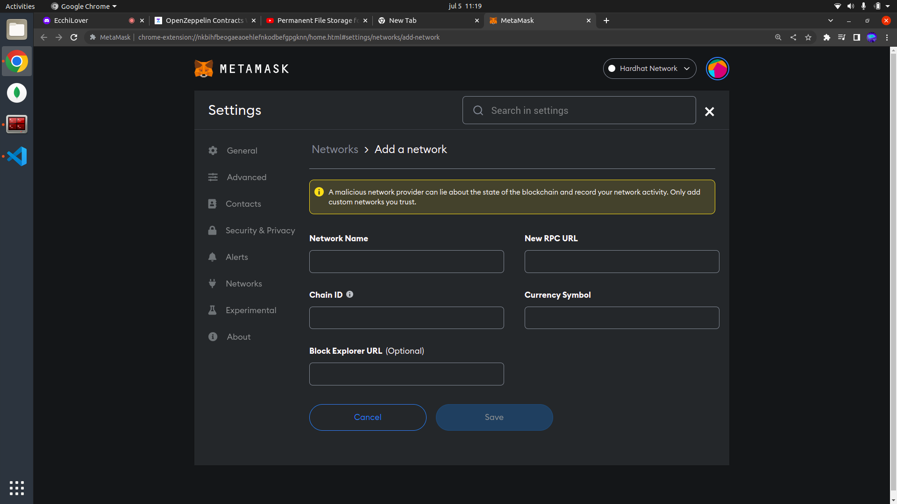
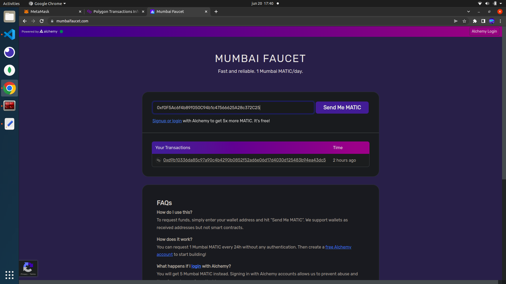
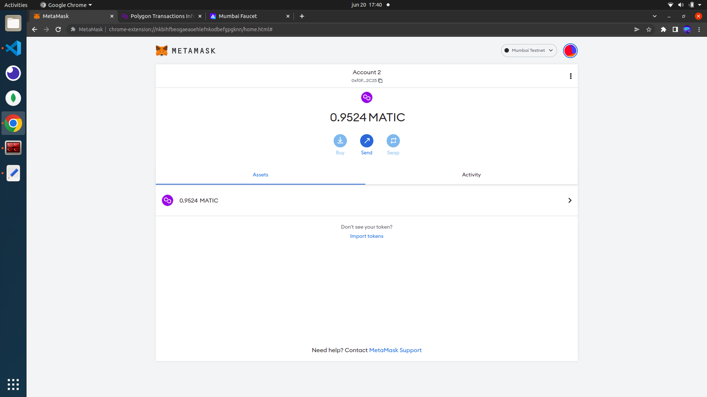
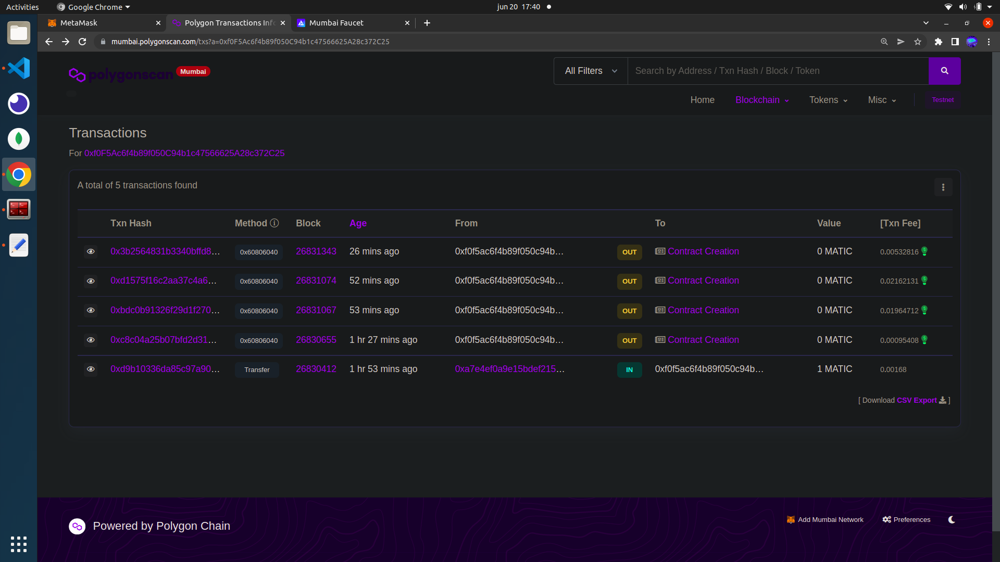
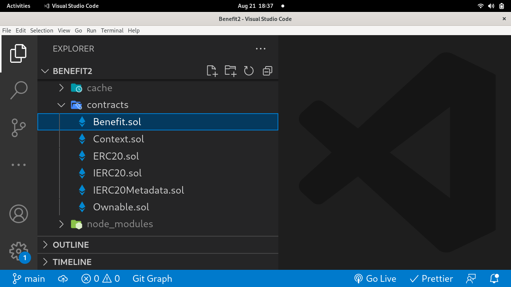

# Benefit 2


## Description:

Benefit 2 is a decentralized broker designed for users to enter funds with which we will operate to transfer the benefits to the contract, allowing each one to withdraw benefits proportional to the amount they have entered.

For its development we have used Hardhat, React and Metamask among other technologies.

## Set up:

### How to import the network in Metamask:

At the top, where we have the networks we have to select Add network.



Once this is done we have two options:

The first one would be to import the local network if we are working with a local node. In this case, the URL will be http://localhost:8545 and the string id will be 31337.

The second one is to import the Polygon (Mumbai) testnet. The parameters are the following.

- Network Name: Mumbai Testnet

- New RPC URL: https://rpc-mumbai.maticvigil.com/

- Chain ID: 80001

- Currency Symbol: MATIC

- Block Explorer URL: https://polygonscan.com/

### Steps to follow to work with Hardhat:

#### Create the project:

Note: If you have downloaded this repository go the following step.

To create the project we will use the npx hardhat command

The resulting structure will contain the following files and directories among others:

- A contracts directory with the smart contracts to deploy.
- An artifacts folder with the material resulting from the compilation of the contract.
- A scripts folder that contains the .js file in charge of executing the deployment.
- A hardhat.config.js file with the necessary configuration for the deployment.

#### Edit hardhat.config file:

We have two options in this case:

The first option would be to configure for deployment on a local node:

```
module.exports = {
  solidity: "0.8.4"
};
```

The second is to configure for deployment to a remote network. In this case we will use the Polygon (Mumbai) testnet.

```
module.exports = {
  defaultNetwork: "matic",
  networks: {
    hardhat: {},
    matic: {
      url: "https://rpc-mumbai.maticvigil.com",
      accounts: [process.env.PRIVATE_KEY],
    },
  },
  etherscan: {
    apiKey: process.env.API_KEY,
  },
  solidity: {
    version: "0.8.4",
    settings: {
      optimizer: {
        enabled: true,
        runs: 200,
      },
    },
  },
};
```

The PRIVATE_KEY key will be from the wallet that we are going to use to make the deployment. If you are working remotely, the private key can be obtained from Metamask. If instead, we are working locally, the node will provide us with pairs of keys with funds to be able to carry out operations.

We also add the PolygonScan API_KEY to be able to verify the contract there.

#### Deploy our smart contract:

If we are going to work locally we will have to run npx hardhat node (comment that with Node 18 this command gives an error: Error HH604: Error running JSON-RPC server: error:0308010C:digital envelope routines::unsupported, which is solved by running in the terminal the command: export NODE_OPTIONS=--openssl-legacy-provider).

If we are going to work remotely with the testnet we will need funds to do the deployment. To do this, we will go to a faucet and ask them to send us funds to our wallet:



We will receive the funds to the wallet that we have indicated



To compile the contracts we will use the npx hardhat compile command

For the deployment we will use npx hardhat run scripts/sample-script.js although if we are going to deploy locally it is advisable to use npx hardhat run --network localhost scripts/sample-script.js to avoid problems when starting the node in a console and deploy to another.

We can check the deployment in polygonscan (for deployment to a remote network):



### Open Zeppelin:


Open Zeppelin is a library that allows us to work with already tested and standardized smart contracts. This will allow us to give greater robustness to our decentralized applications.

#### Instalation:

To install Open Zeppelin we have used the command npm install @openzeppelin/contracts. Once this is done, we can import the contract that we want in ours by means of import "@openzeppelin/contracts/token/ERC721/ERC721.sol";

#### Observations:

If, as has been my case, the import fails, we must paste all the contracts we need in the contracts folder and adapt the imports to the new route.

The contracts folder would look like this:



## Frontend notes

In order to work with our contract we have to create instances of it. We need this providers for that:

### Mumbai provider

```
const provider = ethers.getDefaultProvider(
  "https://rpc-mumbai.maticvigil.com/"
);
```

### Localhost provider

```
const provider = ethers.getDefaultProvider("http://localhost:8545/");
```
